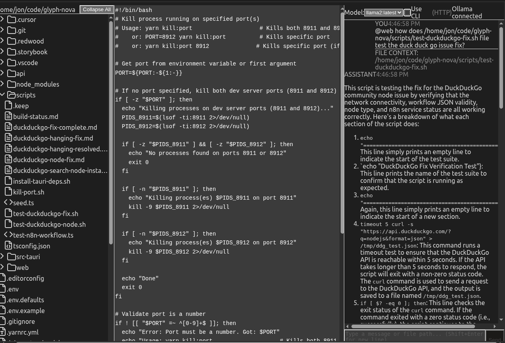

# Glyph Nova - Desktop Chat Application

A desktop application for chatting with local LLMs (via Ollama) with integrated file editing and automatic file context loading.

> ## 🎯 **Long-Term Vision:**
>
> A transparency-first, local-LLM text editor with customizable agentic behavior that replaces Cursor for advanced context engineering. See **[Project Vision](.cursor/docs/reports/project-vision.md)** for the full roadmap.
>
> ### Tool Utility Milestones:
>
> ##### When you use this Tool more than Cursor to
> - Edit a specific kind of file
> - Use it more for writing certain scripts
> - Create and iterate on kinds of Software
>
> #### When Automatic Encoding of Agentic behavior
> - Becomes actually useful
> - Speeds up Chat Based text generation Workflows

## Documentation

- **Vision:** [Project Vision](.cursor/docs/reports/project-vision.md)
- **Future Features:** [future-features/index](.cursor/docs/reports/future-features/index.md)
  - Transparency & Observability, Context Engineering, Agentic Mode System, Self-Improvement, Multi-Machine Swarm, Editor Experience, Implementation Roadmap, Design Decisions, and more
- **RAG CLI:** [RAG System Documentation](scripts/rag/README.md) - Document indexing and semantic search tool

## Features

- 📁 **File Tree** - Browse and manage project files with VSCode-like interface
- ✏️ **Editor** - Edit markdown and code files (80+ languages) with syntax highlighting
- 💬 **Chat** - Interact with local LLMs via Ollama
- 🔗 **File Context** - Automatically load file contents into chat context
- 💾 **Auto-save** - Ctrl/Cmd+S to save files
- 🎨 **VSCode Theme** - Dark theme matching VSCode's appearance

## Current Status

### Current Functionality

**Core Features Implemented:**

- ✅ **File Tree** - Expand/collapse directories, file selection, context menu with "Copy Path" and "Copy Path to Chat"
- ✅ **Unified Editor** - Markdown preview (Vditor) and code syntax highlighting (80+ languages), file save (Ctrl/Cmd+S)
- ✅ **Chat Interface** - Real-time streaming responses, Ollama model selector, file context loading, message history
- ✅ **Cross-Panel Communication** - Zustand state management connecting all panels
- ✅ **File Context Integration** - Automatic file content loading when paths are mentioned in chat

**Technical Implementation:**

- ✅ GraphQL API for file operations and chat
- ✅ Streaming chat responses from Ollama
- ✅ VSCode dark theme styling
- ✅ Desktop app support via Tauri (optional)

### Limitations

**Known Limitations:**

- ⚠️ **Syntax Highlighting** - No syntax highlighting while editing; minimal functional styling in the editor
- ⚠️ **Chat-to-Editor Communication** - LLM cannot directly edit files from chat responses (parsing and applying edits not implemented)
- ⚠️ **Desktop App Compatibility** - Desktop app requires:
  - **Windows:** Windows 7+ with WebView2 (included in Windows 10 20H2+, installable on earlier versions)
  - **macOS:** macOS 10.15 (Catalina) or later
  - **Linux:** Modern distributions with WebKitGTK (most distributions supported)
- ⚠️ **Large Directory Performance** - No virtual scrolling for directories with 1000+ files
- ⚠️ **Error Handling** - Limited error boundaries and user-friendly error messages
- ⚠️ **Storybook** - Component development tool not fully configured

For detailed implementation status and remaining work, see [Implementation Status Report](.cursor/docs/reports/implementation-status.md).

### Screenshot Gallery

The following screenshots demonstrate the application flow and key features:


| Screenshot                                                                    | Description                                                                                             |
| ------------------------------------------------------------------------------- | --------------------------------------------------------------------------------------------------------- |
|                    | **File Tree Context Menu** - Right-click any file to copy its path to clipboard or append to chat input |
|  | **Sending Message** - Type a message with file context and send to Ollama                               |
|      | **Streaming Response** - Real-time streaming of LLM response as it's generated                          |
|     | **Response Beginning** - Formatted markdown response starts appearing                                   |
|    | **Complete Response** - Fully rendered markdown response with code blocks                               |

## Prerequisites

1. **Node.js 18+** and **Yarn**
2. **Ollama** - Local LLM runtime

### Install Ollama

```bash
# Linux
curl -fsSL https://ollama.com/install.sh | sh

# macOS
brew install ollama

# Windows
# Download from https://ollama.com/download
```

### Pull a Model

```bash
# Choose one or more models
ollama pull llama2
ollama pull mistral
ollama pull codellama
```

## Installation

```bash
# Install dependencies
yarn install

# Build the project (optional, for production)
yarn rw build
```

## Running the Application

### Development Mode

```bash
# Start both API and web servers
yarn rw dev
```

The application will open at **http://localhost:8912**

### Production Mode

```bash
# Build first
yarn rw build

# Then serve
yarn rw serve
```

### Desktop App (Tauri)

**Platform Compatibility:**

- ✅ **Linux** - x64 and ARM64

  - Tested on Pop!_OS (Ubuntu-based)
  - Output formats: `.deb`, `.rpm`, `.AppImage`
  - No specific minimum OS version requirement
- ✅ **macOS** - x64 (Intel) and ARM64 (Apple Silicon)

  - **Minimum OS Version:** macOS 10.15 (Catalina) or later
  - Output format: `.dmg` (disk image)
  - Uses native WKWebView (included in macOS)
  - Apple Silicon (M1/M2/M3) fully supported
- ✅ **Windows** - x64 and ARM64

  - **Minimum OS Version:** Windows 7 or later
  - **WebView2 Requirement:**
    - Included in Windows 10 version 20H2 (October 2020 Update) and later
    - For Windows 7-10 (pre-20H2): WebView2 Evergreen Bootstrapper can be bundled with installer
  - Output format: `.exe` (installer) or `.msi`
  - Architecture: x64 (64-bit) and ARM64

**Build Notes:**

- The desktop app build output depends on your system architecture
- Cross-compilation (building for different platforms) is experimental and may require additional setup
- Current config builds for all platforms (`targets: "all"`)

```bash
# Build desktop app (builds for your current platform)
yarn tauri build

# Development mode (with hot reload)
yarn tauri dev
```

The built application will be in `src-tauri/target/release/bundle/` with platform-specific installers:

- Linux: `.deb`, `.rpm`, `.AppImage`
- macOS: `.dmg`
- Windows: `.exe` or `.msi`

## Scripts

### RAG CLI

The project includes a RAG (Retrieval-Augmented Generation) CLI tool for indexing and querying documents:

```bash
# Index documents
yarn rag index <path>              # Index file, folder, or multiple paths

# Query indexed documents
yarn rag query "your question"    # Ask questions about indexed content
```

For detailed documentation, see [scripts/rag/README.md](scripts/rag/README.md).

## Usage

### File Tree (Left Panel)

- Click folders to expand/collapse
- Click files to open in editor
- Right-click for context menu:
  - **Copy Path** - Copy file path to clipboard
  - **Copy Path to Chat** - Append file path to chat input

### Editor (Center Panel)

- **Markdown files** (.md) - Opens in Vditor with instant preview
- **Code files** - Opens with syntax highlighting
- **Ctrl/Cmd+S** - Save current file
- Unsaved changes tracked automatically

### Chat (Right Panel)

- **Model selector** - Choose Ollama model (top of panel)
- **Health indicator** - Shows Ollama connection status
- **File context** - Mention file paths in messages to include file content:
  - `/path/to/file.js help me fix this function`
  - Right-click file → "Copy Path to Chat"
- **Enter** - Send message
- **Shift+Enter** - New line

## Configuration

### Environment Variables

Create a `.env` file in the project root:

```env
# Ollama API URL (default: http://localhost:11434)
OLLAMA_BASE_URL=http://localhost:11434

# Default folder to open (default: $HOME)
DEFAULT_FOLDER_PATH=/path/to/your/projects
```

### Ports

Default ports (configured in `redwood.toml`):

- Web: **8912**
- API: **8911**

## Development

### Storybook (Component Development)

Storybook configuration is included but requires additional setup for Redwood.js projects.

### Project Structure

```
glyph-nova/
├── api/                      # Backend (GraphQL API)
│   ├── src/
│   │   ├── graphql/         # GraphQL schemas and resolvers
│   │   │   ├── files.sdl.ts   # File operations API
│   │   │   └── chat.sdl.ts    # Chat operations API
│   │   └── services/        # Business logic
│   │       ├── files/         # File system operations
│   │       └── ollama/        # Ollama integration
├── web/                      # Frontend (React)
│   ├── src/
│   │   ├── components/      # React components
│   │   │   ├── Chat/          # Chat interface
│   │   │   ├── Editor/        # File editor
│   │   │   ├── FileTree/      # File tree
│   │   │   └── Layouts/       # Layout components
│   │   ├── pages/           # Page components
│   │   │   └── HomePage/      # Main application page
│   │   ├── services/        # Frontend services
│   │   │   └── context.ts     # File context loading
│   │   └── state/           # State management
│   │       └── store.ts       # Zustand store
├── scripts/                  # Utility scripts
│   └── rag/                  # RAG CLI tool (see scripts/rag/README.md)
└── src-tauri/               # Desktop app (Tauri - optional)
```

## Technologies Used

### Frontend

- **Redwood.js** - Full-stack React framework
- **React** - UI library
- **Zustand** - State management
- **Vditor** - Markdown editor
- **react-syntax-highlighter** - Code highlighting
- **react-markdown** - Markdown rendering
- **Tailwind CSS** - Styling

### Backend

- **GraphQL** - API layer
- **Node.js** - Runtime
- **Ollama** - LLM integration

### Desktop (Optional)

- **Tauri** - Desktop app framework

## Troubleshooting

### Ollama Not Connecting

1. Verify Ollama is running:

   ```bash
   ollama list  # Should show installed models
   ```
2. Check Ollama is accessible:

   ```bash
   curl http://localhost:11434/api/tags
   ```
3. Restart Ollama:

   ```bash
   # Linux/macOS
   ollama serve
   ```

### Port Already in Use

If ports 8911 or 8912 are in use, edit `redwood.toml` to change the ports.

### Build Errors

```bash
# Clean and reinstall dependencies
rm -rf node_modules
yarn install
yarn rw build
```

## License

MIT

## Support

For issues and questions, please create an issue in the repository.

---

**Built with Redwood.js and Ollama** 🚀
